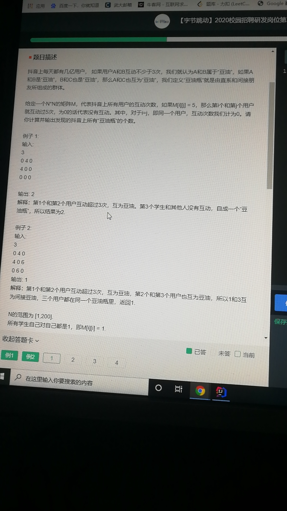
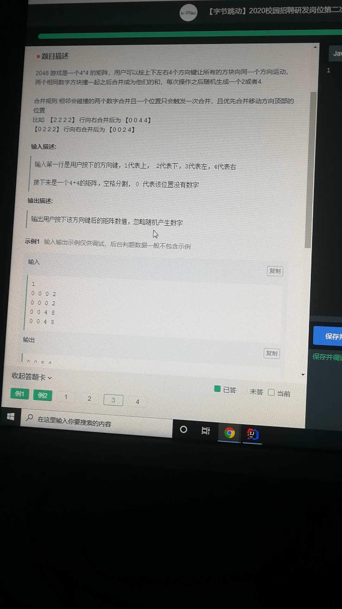
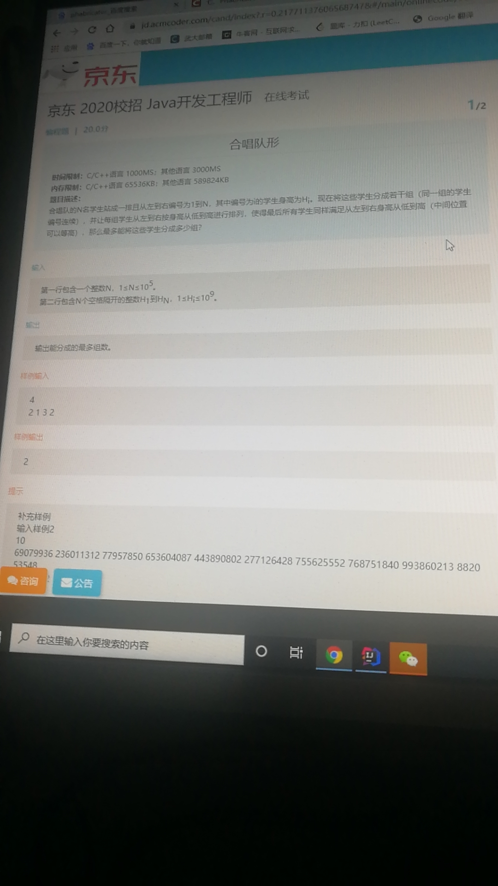

<!-- TOC -->
- [1. 前缀消除](#1-前缀消除)    
    - [1.1. 解析](#11-解析)
- [2. 算式交换](#2-算式交换)    
    - [2.1. 解析](#21-解析)
- [3. 目标值求和](#3-目标值求和)
    - [3.1. 解析](#31-解析)
- [4. 豆油瓶](#4-豆油瓶)
    - [4.1. 解析: 求无向图最大连通分量](#41-解析-求无向图最大连通分量)
- [5.2048](#52048)
    - [5.1. 解析:](#51-解析)
- [6. 编队分组](#6-编队分组)
    - [6.1. 解析:](#61-解析)
- [7. 无人监考](#7-无人监考)
    - [7.1. 解析:](#71-解析)
- [8. 编辑距离](#8-编辑距离)
    - [8.1. 解析：](#81-解析)
- [9. top K](#9-top-k)
    - [9.1. 解析：](#91-解析)
- [10. 快排加求第k大数](#10-快排加求第k大数)
    - [10.1. 解析：](#101-解析)
- [11. 切分链表](#11-切分链表)
    - [11.1. 解析](#111-解析)
- [12. 背包问题](#12-背包问题)
    - [12.1. 解析](#121-解析)
- [13. 链表归并](#13-链表归并)
    - [13.1. 解析](#131-解析)
- [14. 全排列相关](#14-全排列相关)
    - [14.1. 解析](#141-解析)
- [15. 二分查找](#15-二分查找)
    - [15.1. 解析](#151-解析)
- [16. 任务调度的最小时间(变种二分查找)](#16-任务调度的最小时间(变种二分查找))
    - [16.1. 解析](#161-解析)
<!-- /TOC -->

# 1. 前缀消除

## 1.1. 解析
    #include <cstdio>
    #include <algorithm>
    #include <vector>
    #include <cstring>
    using namespace std;
    #define MAX_N 100010
    #define INF 0x3f3f3f

    int a[MAX_N],b[MAX_N];
    vector <int> l[MAX_N];
    int n,s,e;
    int dp[MAX_N][310];

    int main() {
        memset(dp,INF,sizeof(dp));
        scanf("%d%d%d",&n,&s,&e);
        for (int i=1;i<=n;i++) scanf("%d",&a[i]);
        for (int i=1;i<=n;i++) {
            scanf("%d",&b[i]);
            l[b[i]].push_back(i);
        }
        int tot=s/e;
        int ans=0;
        dp[0][0]=0;
        for (int i=1;i<=n;i++) {
            dp[i][0]=0;
            for (int j=1;j<=tot;j++) {
                dp[i][j]=dp[i-1][j];
                int aa=upper_bound(l[a[i]].begin(),l[a[i]].end(),dp[i][j-1])-l[a[i]].begin();
                if (aa<l[a[i]].size()) {
                    dp[i][j]=min(dp[i][j],l[a[i]][aa]);
                }
                if (j>ans && j*e+i+dp[i][j]<=s) {
                    ans=j;
                }
            }
        }
        printf("%d",ans);
    }

# 2. 算式交换

## 2.1. 解析

# 3. 目标值求和
    给定数组以及目标值，求所有和为目标值的序列
    输入: arr[] = {1,2,3,4,5,6,7,8,9,10},target = 10
    输出: {1,9},{2,8},{3,7},{4,6},{1,2,7},{1,3,6},{1,4,5},{2,3,5}
## 3.1. 解析
    import java.util.ArrayList;
    import java.util.Arrays;
    import java.util.Scanner;

    /**
    * @Auther: qiu
    * @Date: 2019/8/29 17:13
    * @Description: 给定数组和目标和，求所有满足和target的子序列
    **/
    public class SubSumToTarget {

        public static void main(String[] args) {
            Scanner in = new Scanner(System.in);
            int n = in.nextInt();
            int target = in.nextInt();
            int[] arr = new int[n];
            for (int i = 0; i < n; i ++) {
                arr[i] = in.nextInt();
            }
            Arrays.sort(arr);
            ArrayList<ArrayList<Integer>> res = new ArrayList<>();
            boolean[] visited = new boolean[n];
            backTrace(res, arr, visited, n, 0, 0, target);
            for (ArrayList<Integer> list : res) {
                for (int num : list) {
                    System.out.print(num + " ");
                }
                System.out.println();
            }
        }

        static void backTrace(ArrayList<ArrayList<Integer>> res, int[] arr, boolean[] visited,
                            int n, int i, int sum, int target) {
            if (sum > target) {
                return;
            } else if (sum == target) {
                ArrayList<Integer> list = new ArrayList<>();
                for (int j = 0; j < n; j ++) {
                    if (visited[j]) {
                        list.add(arr[j]);
                    }
                }
                res.add(list);
                return;
            } else {
                //当前遍历完且sum<target则返回
                if (i == n-1) {
                    return;
                }
            }
            for (int j = i; j < n; j ++) {
                if (!visited[j]) {
                    /**
                    * 在当前遍历过程中标记当前节点已访问，
                    * 下一次遍历时要恢复当前节点为未访问,以重复利用
                    **/
                    sum += arr[j];
                    visited[j] = true;
                    //深搜
                    if (j < n-1) {
                        backTrace(res, arr, visited, n, j+1, sum, target);
                    } else if (j == n-1){
                        backTrace(res, arr, visited, n, j, sum, target);
                    }
                    //本次深搜完恢复元素可访问性
                    visited[j] = false;
                    sum -= arr[j];

                    //对于重复元素只统计一次
                    while (j < n-1 && arr[j] == arr[j+1]) {
                        j ++;
                    }
                }
            }
        }
    }

# 4. 豆油瓶

## 4.1. 解析: 求无向图最大连通分量
    import java.util.Scanner;

    /**
    * @Auther: qiu
    * @Date: 2019/8/26 21:18
    * @Description: 豆油瓶(graph[i][j] >= 3表示连通)
    **/
    public class MaxStrongConnectedComponent {

        public static void main(String[] args) {
            Scanner in = new Scanner(System.in);
            int n = in.nextInt();
            int[][] graph = new int[n+1][n+1];
            for (int i = 1; i <= n; i ++) {
                for (int j = 1; j <= n; j ++) {
                    graph[i][j] = in.nextInt();
                }
            }
            int res = 0;
            boolean[] f = new boolean[n+1];
            for (int i = 1; i <= n; i ++) {
                if (!f[i]) {
                    res ++;
                    dfs(graph, n, i, f);
                }
            }
            System.out.println(res);
        }

        static void dfs(int[][] graph, int n, int i, boolean[] f) {
            f[i] = true;
            for (int j = 1; j <= n; j ++) {
                //j节点未被访问且graph[i][j] >= 3
                if (!f[j] && graph[i][j] >= 3) {
                    //从j节点开始深搜
                    dfs(graph, n, j, f);
                }
            }
        }
    }

# 5.2048

## 5.1. 解析: 
    import java.util.Scanner;

    public class ZJ3 {
        public static void main(String[] args){
            Scanner sc = new Scanner(System.in);
            int n = sc.nextInt();
            int[][] arr = new int[4][4];
            for(int i = 0; i< 4; i++){
                for(int j = 0; j < 4; j++){
                    arr[i][j] = sc.nextInt();
                }
            }

            if(n == 1){ //向上
                for(int i = 0; i< 3; i++){
                    for(int j = 0; j < 4; j++){
                        if(arr[i+1][j] == arr[i][j]){
                            arr[i][j] = 2*arr[i][j];
                            arr[i+1][j] = 0;
                        }
                    }
                }
                for(int i = 3; i >= 1; i--){
                    for(int j = 3; j >= 0; j--){
                        if(arr[i][j] != 0 && arr[i-1][j] == 0){
                            int tmp = arr[i][j];
                            arr[i][j] = arr[i-1][j];
                            arr[i-1][j] = tmp;
                        }
                    }
                }
            }

            if(n == 2){ //向下
                for(int i = 3; i >= 1; i--){
                    for(int j = 3; j >= 0; j--){
                        if(arr[i-1][j] == arr[i][j]){
                            arr[i][j] = 2*arr[i][j];
                            arr[i-1][j] = 0;
                        }
                    }
                }
                for(int i = 0; i< 3; i++){
                    for(int j = 0; j < 4; j++){
                        if(arr[i][j] != 0 && arr[i+1][j] == 0){
                            int tmp = arr[i][j];
                            arr[i][j] = arr[i+1][j];
                            arr[i+1][j] = tmp;
                        }
                    }
                }
            }

            if(n == 3){ //向左
                for(int i = 0; i< 3; i++){
                    for(int j = 0; j < 4; j++){
                        if(arr[j][i-1] == arr[j][i]){
                            arr[j][i] = 2*arr[j][i];
                            arr[j][i-1] = 0;
                        }
                    }
                }
                for(int i = 3; i >= 1; i--){
                    for(int j = 3; j >= 0; j--){
                        if(arr[j][i] != 0 && arr[j][i+1] == 0){
                            int tmp = arr[j][i];
                            arr[j][i] = arr[j][i+1];
                            arr[j][i+1] = tmp;
                        }
                    }
                }
            }

            if(n == 4){ // 向右
                for(int i = 3; i >= 1; i--){
                    for(int j = 3; j >= 0; j--){
                        if(arr[j][i-1] == arr[j][i]){
                            arr[j][i] = 2*arr[j][i];
                            arr[j][i-1] = 0;
                        }
                    }
                }
                for(int i = 0; i< 3; i++){
                    for(int j = 0; j < 4; j++){
                        if(arr[j][i] != 0 && arr[j][i+1] == 0){
                            int tmp = arr[j][i];
                            arr[j][i] = arr[j][i+1];
                            arr[j][i+1] = tmp;
                        }
                    }
                }
            }
            for(int i = 0; i< 4; i++){
                for(int j = 0; j < 4; j++){
                    System.out.print(arr[i][j] +" ");
                }
                System.out.println();
            }

        }
    }

# 6. 编队分组

## 6.1. 解析: 
    import java.util.Scanner;

    public class Main {

        public static void main (String[] args) {
            Scanner sc = new Scanner(System.in);
            int n = sc.nextInt();
            int[] arr = new int[n];
            for (int i = 0; i < n; i++) {
            arr[i] = sc.nextInt();
            }
            int count = 0;
            int preMax;
            boolean preHasDiv;
            int index = 0;
            int maxIndex = 0;
            for (int i = 0; i < n; i++) {
                preMax = arr[i];
                preHasDiv = true;
                maxIndex = i;
                for (int j = i + 1; j < n; j++) {
                    if (arr[j] < preMax) {
                        preHasDiv = false;
                        index = j;
                        if (maxIndex < j) {
                            preMax = arr[maxIndex];
                        }
                    } else {
                        if (arr[maxIndex] < arr[j]) {
                            maxIndex = j;
                        }
                    }
                }
                if (preHasDiv == false) {
                    i = index;
                }
                count++;
            }
            System.out.println(count);
        }
    }

# 7. 无人监考

## 7.1. 解析: 

# 8. 编辑距离
    添加、删除、替换得到相等字符串所需最少次数
    "eeba" -> "aabc"
## 8.1. 解析：
    s = "eeba", t="abac"
    使用一个二维数组记录所需编辑次数(s为纵向，t为横向)，
	0 1 2 3 4 
	1 1 2 3 4 
	2 2 2 3 4 
	3 3 2 3 4 
	4 3 3 2 3 
	第二列为当t取一个字符a的时候，s依次为  ""、"e"、"ee"、"eeb"、"eeba"所需的编辑距离
	其余的类似
	以动态规划角度来看，以edit(i,j)来代表矩阵中的元素，其意义为i代表s取前i个字符，j代表t取前个字符
	如edit(2,2)代表s="ee"，t="ab"的编辑距离，在矩阵中为2（代码中还有一个0行）
	edit(i,j)=minist(edit(i,j-1)+1, edit(i-1,j)+1, edit(i-1,j-1)+cost)
	edit(2,2)=minist(edit(2,1)+1, edit(1,2)+1, edit(1,1)+cost)
	即取("ee","a")("e","ab")("ee","ab")三个编辑距离中的最小值
	s.charAt(i-1)==t.charAt(j-1)时，cost=1
    
代码: 

    import java.util.Scanner;

    /**
    * @Auther: qiu
    * @Date: 2019/8/29 17:12
    * @Description: 编辑距离：s1转换为s2，只能增加，删除，替换
    * dp[i][j] = if(s1[i] == s2[j]) min(dp[i-1][j] + 1, dp[i][j-1] + 1, dp[i-1][j-1])
    *            else min(dp[i-1][j] + 1, dp[i][j-1] + 1, dp[i-1][j-1] + 1)
    **/
    public class EditDistance {

        public static void main(String[] args) {
            Scanner in = new Scanner(System.in);
            String s1 = in.next();
            String s2 = in.next();
            System.out.println(getEditDistance(s1, s2));
        }

        static int getEditDistance(String s1, String s2) {
            int len1 = s1.length(), len2 = s2.length();
            int[][] dp = new int[len1+1][len2+1];
            //字符串s2为空时要将s1中所有字符删除才能得到s2
            for (int i = 0; i <= len1; i ++) {
                dp[i][0] = i;
            }
            for (int j = 0; j <= len2; j ++) {
                dp[0][j] = j;
            }
            for (int i = 1; i <= len1; i ++) {
                for (int j = 1; j <= len2; j ++) {
                    if (s1.charAt(i-1) == s2.charAt(j-1)) {
                        int tmp = Math.min(dp[i-1][j] + 1, dp[i][j-1] + 1);
                        dp[i][j] = Math.min(tmp, dp[i-1][j-1]);
                    } else {
                        int tmp = Math.min(dp[i-1][j] + 1, dp[i][j-1] + 1);
                        dp[i][j] = Math.min(tmp, dp[i-1][j-1] + 1);
                    }
                }
            }
            return dp[len1][len2];
        }
    }

# 9. top K
    求最大的k个数
## 9.1. 解析：
    建立大小为k的小根堆，后面比堆顶小的直接淘汰，比堆顶大的替换堆顶调整

代码：
    
    import java.util.Scanner;
    /**
    * @Auther: qiu
    * @Date: 2019/8/29 12:06
    * @Description: 求最大top k就建立小根堆，然后淘汰
    **/
    public class TopK {

        public static void main(String[] args) {
            Scanner in = new Scanner(System.in);
            int n = in.nextInt();
            int k = in.nextInt();
            int[] arr = new int[n];
            for (int i = 0; i < n; i ++) {
                arr[i] = in.nextInt();
            }
            findTopK(arr, n, k);
            for (int i = 0; i < n; i ++) {
                System.out.print(arr[i] + " ");
            }
        }

        static void findTopK(int[] arr, int len, int k) {
            //建立大小为k的堆
            for (int i = k/2 - 1; i >= 0; i --) {
                adjustHeap(arr, k, i);
            }
            for (int j = k; j < len; j ++) {
                if (arr[j] > arr[0]) {
                    int temp = arr[j];
                    arr[j] = arr[0];
                    arr[0] = temp;
                    adjustHeap(arr, k, 0);
                }
            }
        }
        static void adjustHeap(int[] arr, int len, int idx) {
            int tmp = arr[idx];
            for (int k = 2*idx+1; k < len; k = 2*k+1) {
                if (k+1 < len && arr[k] > arr[k + 1]) {
                    k ++;
                }
                if (arr[k] < tmp) {
                    arr[idx] = arr[k];
                    idx = k;
                } else {
                    break;
                }
            }
            arr[idx] = tmp;
        }
    }

# 10. 快排加求第k大数

## 10.1. 解析：
    堆排序，若partition得到的位置为k则直接返回

代码: 

    import java.util.*;

    /**
    * @Author qiu
    * @Description //快排求第k大节点
    * @Date 2019/8/29 15:37
    * @Param
    * @return
    **/
    public class QuickSort {
        public static void main(String[] args) {
            Scanner in = new Scanner(System.in);
            int n = in.nextInt(); //数组长度
            int arr[] = new int[n];
            for (int i = 0; i < n; i++) {
                arr[i] = in.nextInt();
            }
            //quickSort(arr,0,n-1);
            findTopK(arr, 0, n - 1, 4);
            for (int i = n - 4; i < n; i++) {
                System.out.print(arr[i]);
            }
        }

        static void quickSort(int arr[], int s, int e) {
            if (s < e) {
                int p = getPart(arr, s, e);
                quickSort(arr, s, p - 1);
                quickSort(arr, p + 1, e);
            }
        }

        static void findTopK(int arr[], int s, int e, int k) {
            if (s < e) {
                int p = getPart(arr, s, e);
                if (p == k)
                    return;
                if (p < k)
                    findTopK(arr, p + 1, e, arr.length - k);
                else
                    findTopK(arr, s, p - 1, arr.length - k);
            }
        }

        /**
        * 以s作为分割点，比arr[s]大的放到后面，小的放在前面
        **/
        static int getPart(int arr[], int s, int e) {
            int key = arr[s];
            while (s < e) {
                while (s < e && arr[e] >= key)
                    e--;
                if (s < e)
                    arr[s] = arr[e];
                while (s < e && arr[s] <= key)
                    s++;
                if (s < e)
                    arr[e] = arr[s];
            }
            arr[s] = key;
            return s;
        }
    }

# 11. 切分链表
    给定链表以及target，将小于target的放在左边，大于target的放在右边

## 11.1. 解析
    将小于target从链表中切分出来添加到新指针后，然后将新指针的next指向head

代码: 
    import java.util.Scanner;
    
    /**
     * @Auther: qiu
     * @Date: 2019/8/31 11:12
     * @Description: 给定链表以及target，将比target小于等于的放在左边，大的放在右边
     **/
    public class ListPartition {
    
        public static void main(String[] args) {
            Scanner in = new Scanner(System.in);
            int n = in.nextInt();
            int target = in.nextInt();
            int[] arr = new int[n];
            for (int i = 0; i < n; i++) {
                arr[i] = in.nextInt();
            }
            ListNode head = createList(arr, n);
            head = partition_doubleNode(head, target);
            while (head != null) {
                System.out.print(head.val + " ");
                head = head.next;
            }
        }
    
        /**
          * @Author qiu
          * @Description //双指针，用于存大于target和小于target的
          * @Date 2019/9/4 22:04
          * @Param [head, target]
          * @return com.company.ListPartition.ListNode
        **/
        static ListNode partition_doubleNode(ListNode head, int target) {
            ListNode l1 = null, l2 = null;
            ListNode p = l1, q = l2;
            while (head != null) {
                if (head.val <= target) {
                    if (l1 == null) {
                        l1 = head;
                        p = l1;
                    } else {
                        p.next = head;
                        p = p.next;
                    }
                } else {
                    if (l2 == null) {
                        l2 = head;
                        q = l2;
                    } else {
                        q.next = head;
                        q = q.next;
                    }
                }
                head = head.next;
            }
            p.next = l2;
            q.next = null;
            return l1;
        }
    
        /**
          * @Author qiu
          * @Description //将所有小于target的数从原链表中抽出，
         *              结束循环后将抽出来的链表最后一个元素的next指向head即可
          * @Date 2019/9/4 21:04
          * @Param [head, target]
          * @return com.company.ListPartition.ListNode
        **/
        static ListNode partition (ListNode head, int target) {
            ListNode p = head, res = null, r = null, prev = null;
            while (p != null) {
                //找出所有小于target的元素
                if (p.val <= target) {
                    if (r != null) {
                        if (prev == null) {
                            head = p.next;
                        } else {
                            prev.next = p.next;
                        }
                        r.next = p;
                        r = r.next;
                    } else {
                        if (prev == null) {
                            head = p.next;
                        } else {
                            prev.next = p.next;
                        }
                        r = p;
                        res = r;
                    }
                } else {
                    prev = p;
                }
                p = p.next;
            }
            if (r == null) {
                return head;
            } else {
                r.next = head;
                return res;
            }
        }
        static ListNode createList(int[] arr, int n) {
            ListNode head = new ListNode(arr[0], null);
            ListNode p = head;
            for (int i = 1; i < n; i++) {
                ListNode q = new ListNode(arr[i], null);
                p.next = q;
                p = q;
            }
            return head;
        }
    
        private static class ListNode {
            int val;
            ListNode next;
            public ListNode(int val, ListNode next) {
                this.val = val;
                this.next = next;
            }
        }
    }

# 12. 背包问题
    0-1背包，多重背包
## 12.1. 解析
    /**
    * @ClassName BagProblem
    *
    * @Author qiu
    * @Date 2019/4/12 16:05
    * @Version 1.0
    **/
    public class BagProblem {

        public static void main(String[] args) {
            System.out.print(Bag_0_1(new int[]{5,4,3,5,2},new int[]{2,2,3,5,1},5,10));
            System.out.print(Bag_complete(new int[]{5,4,3,5,2},new int[]{2,2,3,5,1},5,10));
            System.out.print(Bag_n(new int[]{5,4,3,5,2},new int[]{2,2,3,5,1},new int[]{1,2,3,4,5},5,10));
        }

        /**
        * @Author qiu
        * @Description //0-1背包问题：背包容量target，n件物品，value为价值数组，weight为重量数组
        * 问题为求固定大小背包所能容纳的最大价值
        * @Date 2019/4/16 13:06
        * @Param [value, weight, n, target]
        * @return int
        **/
        public static int Bag_0_1(int value[], int weight[],int n,int target){
            //dp[i][j]表示容量为j的背包放入第i件物品的最大价值
            //状态转移：dp[i][j] = max{dp[i-1][j],dp[i-1][j-weight[i]]+value[i]}
            //即不放入第i件物品的价值与放入第i件物品的最大价值的较大者
            int dp[][] = new int[n+1][target+1];
            for(int i = 1;i<=n;i++){
                for(int j = 1;j<=target;j++){
                    dp[i][j] = dp[i-1][j];
                    if(j>=weight[i-1]){
                        dp[i][j] = Math.max(dp[i-1][j],dp[i-1][j-weight[i-1]]+value[i-1]);
                    }
                }
            }
            return dp[n][target];
        }

        /**
        * @Author qiu
        * @Description //每件物品可以无限重复利用
        * @Date 2019/4/16 13:48
        * @Param [value, weight, n, target]
        * @return int
        **/
        public static int Bag_complete(int value[],int weight[],int n,int target){
            int dp[] = new int[target+1];
            for(int i = 1;i<=target;i++){
                for(int j = 1;j<=n;j++){
                    if(i>=weight[j-1]){
                        dp[i] = Math.max(dp[i],dp[i-weight[j-1]]+value[j-1]);
                    }
                }
            }
            return dp[target];
        }

        /**
        * @Author qiu
        * @Description //n重背包：第i件产品可重用nums[i]次
        * @Date 2019/4/16 14:43
        * @Param [value, weight, nums, n, target]
        * @return int
        **/
        public static int Bag_n(int value[],int weight[],int nums[],int n,int target){
            int dp[][] = new int[n+1][target+1];
            for(int i = 1;i<=n;i++){
                for(int j = 1;j<=target;j++){
                    int min_num = Math.min(nums[i-1],target/weight[i-1]);
                    dp[i][j] = dp[i-1][j];
                    for(int k = 0;k <= min_num;k++){
                        if(j>=k*weight[i-1])
                            dp[i][j] = Math.max(dp[i][j],dp[i-1][j-k*weight[i-1]]+k*value[i-1]);
                    }
                }
            }
            return dp[n][target];
        }
    }

# 13. 链表归并
    升序链表与降序链表归并
## 13.1. 解析
    import java.util.Scanner;
    /**
    * @Auther: qiu
    * @Date: 2019/8/31 10:51
    * @Description:
    **/
    public class MergeList {

        public static void main(String[] args) {
            Scanner in = new Scanner(System.in);
            int n = in.nextInt();
            int[] arr1 = new int[n];
            for (int i = 0; i < n; i++) {
                arr1[i] = in.nextInt();
            }
            ListNode head1 = createList(arr1, n);
            int m = in.nextInt();
            int[] arr2 = new int[m];
            for (int i = 0; i < m; i++) {
                arr2[i] = in.nextInt();
            }
            ListNode head2 = createList(arr2, m);
            head2 = reverse(head2);
            ListNode res = merge(head1, head2);
            while (res != null) {
                System.out.print(res.val + " ");
                res = res.next;
            }
        }

        //归并链表
        static ListNode merge (ListNode n1, ListNode n2) {
            if (n1 == null) {
                return n2;
            }
            if (n2 == null) {
                return n1;
            }
            //r用于存储归并后的链表
            ListNode p = n1, q = n2, r ,res;
            if (p.val > q.val) {
                r = q;
                q = q.next;
            } else {
                r = p;
                p = p.next;
            }
            res = r;
            while (p != null && q != null) {
                //将q节点写入r中
                if (p.val > q.val) {
                    r.next = q;
                    q = q.next;
                    r = r.next;
                } else {
                    //将p节点写入r后
                    r.next = p;
                    p = p.next;
                    r = r.next;
                }
            }
            //如果n1未循环完则将r.next指向p
            if (p != null) {
                r.next = p;
            }
            //如果n2未循环完则将r.next指向q
            if (q != null) {
                r.next = q;
            }
            return res;
        }

        //降序链表转升序链表
        static ListNode reverse (ListNode head) {
            ListNode p = head, prev = null, r = null;
            while (p != null) {
                r = p.next;
                p.next = prev;
                prev = p;
                p = r;
            }
            head = prev;
            return head;
        }
        static ListNode createList(int[] arr, int n) {
            ListNode head = new ListNode(arr[0], null);
            ListNode p = head;
            for (int i = 1; i < n; i++) {
                ListNode q = new ListNode(arr[i], null);
                p.next = q;
                p = q;
            }
            return head;
        }

        private static class ListNode {
            int val;
            ListNode next;
            public ListNode(int val, ListNode next) {
                this.val = val;
                this.next = next;
            }
        }
    }
    
# 14. 全排列相关
    求数组的全排列，找第k个排列，找下一个排列
## 14.1. 解析
    import java.util.ArrayList;
    import java.util.Scanner;
    
    /**
     * @Auther: qiu
     * @Date: 2019/9/3 13:39
     * @Description: 排列问题：全排列，第k个排列，下一个排列
     **/
    public class Permutation {
    
        public static void main(String[] args) {
            Scanner in = new Scanner(System.in);
            int n = in.nextInt();
            int[] arr = new int[n];
            for (int i = 0; i < n; i++) {
                arr[i] = in.nextInt();
            }
            /*ArrayList<ArrayList<Integer>> res = new ArrayList<>();
            fullPermutation(arr, res, 0);
            System.out.println(res.size());
            res.forEach(list -> {
                list.forEach(val -> {
                    System.out.print(val + " ");
                });
                System.out.println();
            });*/
            /*findNextPermutation(arr);
            for (int i = 0; i < arr.length; i++) {
                System.out.print(arr[i] + " ");
            }*/
            System.out.print(findKPermutation(4, 15));
        }
    
        /**
         * @return void
         * @Author qiu
         * @Description //全排列
         * @Date 2019/9/3 13:41
         * @Param [arr, n]
         **/
        private static void fullPermutation(int[] arr, ArrayList<ArrayList<Integer>> res, int idx) {
            if (idx == arr.length - 1) {
                ArrayList<Integer> list = new ArrayList<>();
                for (int i = 0; i < arr.length; i++) {
                    list.add(arr[i]);
                }
                res.add(list);
                return;
            }
            //每次都拿当前起始位置的数与后面的每个位置的数交换，
            //这样一次交换后只需要递归去保证当前起始位置后的数组是全排列的即可
            for (int i = idx; i < arr.length; i++) {
                swap(arr, idx, i);
                fullPermutation(arr, res, idx + 1);
            }
    
        }
    
        /**
          * @Author qiu
          * @Description //找出1~n全排列中的第k个排列
          * @Date 2019/9/3 14:21
          * @Param [arr]
          * @return void
        **/
        private static String findKPermutation(int n, int k) {
            //用于存储待选择的数，每次选择后删除
            ArrayList<Integer> nums = new ArrayList<>();
            StringBuilder res = new StringBuilder();
            //存储(n-i)!的结果
            int[] f = new int[n+1];
            f[0] = 1;
            //标号从0开始
            k = k-1;
            for (int i = 1; i <= n; i ++) {
                f[i] = i * f[i-1];
                nums.add(i);
            }
            //对于1,2，3,4来说要求其第20个排列
            //对于以1开头的全排列有(4-1)!个，以2,3,4开头都是一样的，因此可以先计算
            // k/(n-1)!+1得到第k个排列的第一个数（20/(4-1)! + 1 = 4),
            // 然后重新计算k = k - (k/(n-1)!)*(n-1)!,依次类推(k = 0时表示已经找到了)
            for (int i = 1; i <= n; i ++) {
                int idx = k/f[n-i];
                res.append(nums.remove(idx));
                k -= idx * f[n-i];
            }
            return res.toString();
        }
    
        /**
          * @Author qiu
          * @Description //找出全排列中当前排列的下一个排列
          * @Date 2019/9/3 14:21
          * @Param [nums]
          * @return void
        **/
        private static void findNextPermutation(int[] nums) {
            int len = nums.length;
            int k = len - 1;
            //从后往前找非递减序列第一个元素，如对于{0,5,4,3,2,1}为k=1
            while (k - 1 >= 0 && nums[k-1] >= nums[k]) {
                k --;
            }
            if (k == 0) {
                //如果k=0表示序列一直为递减，也即全排列最后一个组合，此时返回全排列第一个序列，也即递增序列
                for (int i = 0; i < len / 2; i++) {
                    swap(nums, i, len - i - 1);
                }
            }
            //否则从后往前找第一个比nums[k-1]大的数，然后让其与nums[k-1]交换
            //之后只需要将从k之后的数组从小到大排序即可得到下一个排列
            int j = len - 1;
            while (j >= k && nums[j] <= nums[k-1]) {
                j --;
            }
            swap(nums, k-1, j);
            for (int i = k; i < (len - k)/2 + k; i ++) {
                swap(nums, i, len - i + k - 1);
            }
         }
    
        static void swap(int[] arr, int i, int j) {
            if (i == j) {
                return;
            }
            int tmp = arr[i];
            arr[i] = arr[j];
            arr[j] = tmp;
        }
    }
# 15. 二分查找
    查找数组中指定数target在数组中出现的最小位置和最大位置
## 15.1. 解析
    /**
     * @Auther: qiu
     * @Date: 2019/9/4 15:58
     * @Description:
     **/
    public class FindTargetIdxRange {
    
        public static void main(String[] args) throws Exception{
            int[] res = searchRange(new int[]{1,2,2,2,2,2,2,3}, 2);
            System.out.println(res[0] + " " + res[1]);
        }
    
        private static int[] searchRange(int[] nums, int target) {
            int low = 0, high = nums.length-1, mid;
            int[] res = new int[]{-1, -1};
            if (nums.length == 0) {
                return res;
            }
            //向左边二分查找
            while (low < high) {
                mid = (low+high)/2;
                if (nums[mid] >= target) {
                    high = mid;
                } else {
                    low = mid + 1;
                }
            }
            //target不存在
            if (nums[low] != target) {
                return res;
            }
            //找到target的最小位置
            res[0] = low;
            high = nums.length;
            //向右边二分查找
            while (low < high) {
                mid = (low+high)/2;
                if (nums[mid] <= target) {
                    low = mid+1;
                } else {
                    high = mid;
                }
            }
            res[1] = high-1;
            return res;
        }
    }

# 16. 任务调度的最小时间(变种二分查找)

## 16.1. 解析
    public class SequentialTaskSchedule {
    
        public static void main(String[] args) throws Exception {
            System.out.println(schedule(3, new int[]{1,5,3,4,2}));
        }
    
        /**
         * @Author qiu
         * @Description //任务执行最少时间（变种二分查找）
         * @Date 2019/9/4 21:31
         * @Param [m, array]
         * @return int
         **/
        static int schedule(int m, int[] array) {
            //s表示任务执行玩最少需要的时间(所有任务执行市场的最大值)，
            // e表示任务执行所需最长时间（所有任务串行执行）
            int s = 0, e = 0;
            for (int i = 0; i < array.length; i ++) {
                e += array[i];
                if (s < array[i]) {
                    s = array[i];
                }
            }
            int res = e;
            //对任务执行所需的最小时间到最大时间范围内进行二分查找，找到最小执行时间
            while (s <= e) {
                int mid = (s+e)/2;
                int sum = 0;
                int count = 1; //机器数
                for (int i = 0; i < array.length; i ++) {
                    //表示当执行时间为mid时，最多一个机器能串行执行的时长
                    if (sum + array[i] > mid) {
                        count ++;
                        sum = array[i];
                    } else {
                        sum += array[i];
                    }
                }
                //当执行时间为mid时，所使用的机器数量小于m时，表示机器未充分使用（即有机器未跑任务）
                if (count <= m) {
                    //计算此时所用的时间
                    res = Math.min(res, mid);
                    //机器未充分利用，最少执行时间还可以优化
                    e = mid - 1;
                } else {
                    //若所用机器数量超标，则分配的时间太少
                    s = mid + 1;
                }
            }
            return res;
        }
    }